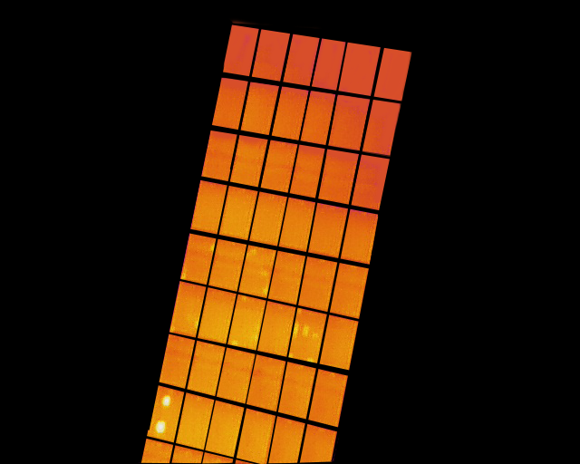
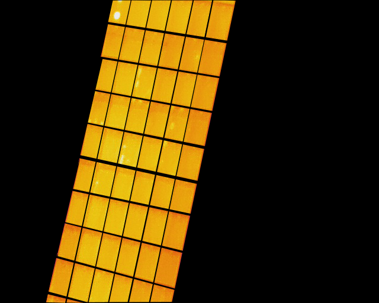
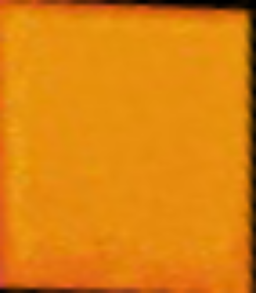
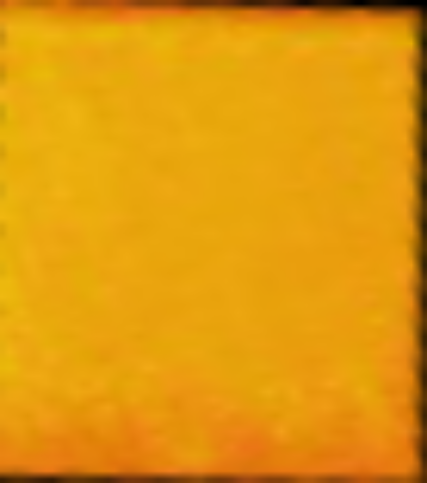
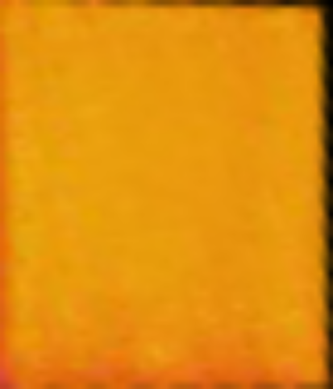
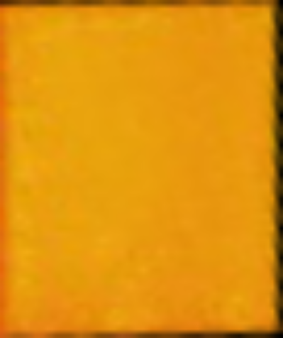
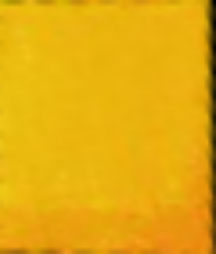
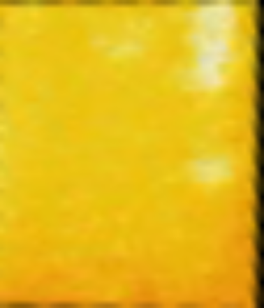
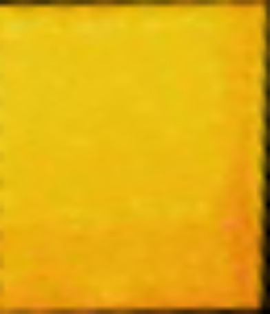
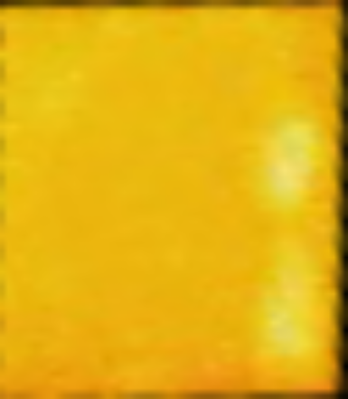

# modules_extraction
An algorithm for extracting module images in array image.

## Results

|  Input   |                             ①                              |                 ②                  |
|:--------:|:----------------------------------------------------------:|:----------------------------------:|
|  Images  |  |    |

|               output               |                1                |                 2                  |                 3                 |                 4                  |
|:----------------------------------:|:-------------------------------------------:|:-------------------------------------------:|:-------------------------------------------:|:-------------------------------------------:|
| ①      |   |   |   |   |
| ②     |    |    |    |    |
